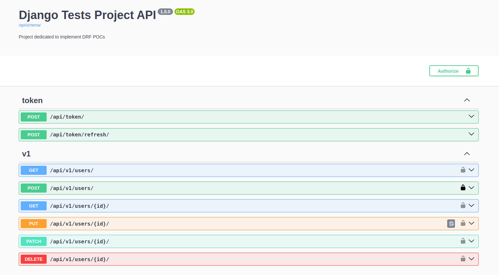

# Django Tests  

## Dependencies  
Python 3.11.9  

## Use Cases  
### Organizations  
`[  ]` User can create organizations  
`[  ]` User can list organizations  
`[  ]` Organization admin can invite users  
`[  ]` Organization owner can delete organization  
`[  ]` Organization admin can set members permission levels  
`[  ]` Organization admin can remove members  
`[  ]` Organization admin can create projects  
`[  ]` Organization member can list projects  
`[  ]` Organization admin can update projects  
`[  ]` Organization admin can delete projects  
`[  ]` Organization admin can define project managers  

### Projects  
`[  ]` Organization admin can invite organization members  
`[  ]` Organization admin can set members permission levels  
`[  ]` Project manager can update project  
`[  ]` Project manager can invite organization members  
`[  ]` Project manager can set members permission levels  
`[  ]` Project manager can remove members  

