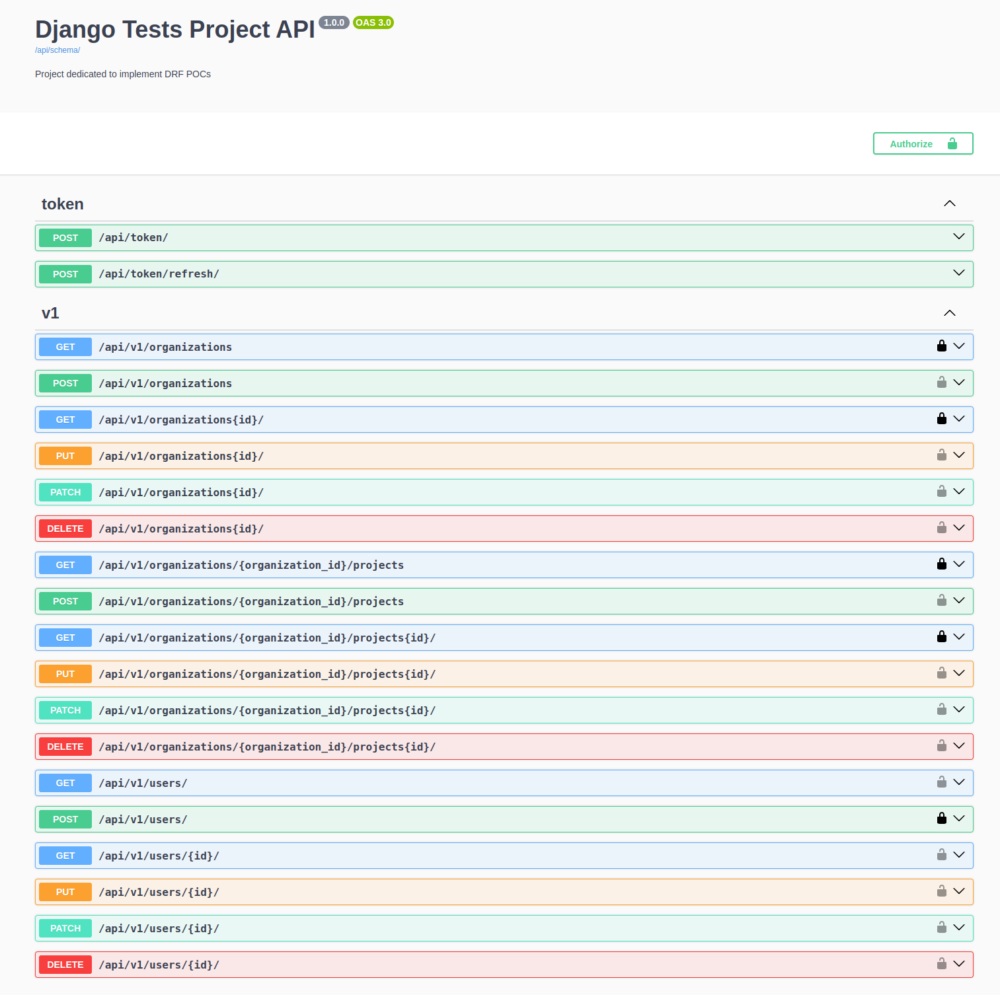

# Django Tests  

## Dependencies  
Python 3.11.9  

## Implemented Use Cases  
### Accounts Management
`[  ]` User can create an account  
`[  ]` User can authenticate using username + password  
`[  ]` User can authenticate using otp/link on the email  
`[  ]` User can authenticate using auth providers  
`[  ]` User can delete its account  
`[  ]` User can reset password using otp on the email  
`[  ]` User can add/update a profile picture  
`[  ]` User can setup a two-factor verification  

### LLM Data Sources (Files) Manipulation
`[  ]` User can upload a data source in pdf, txt, and md formats  
`[  ]` User can select in runtime what data sources to use in each retrieval  

### Organizations
`[  ]` User can create organizations  
`[  ]` User can list organizations  
`[  ]` Organization admin can invite users  
`[  ]` Organization owner can delete organization  
`[  ]` Organization admin can set members permission levels  
`[  ]` Organization admin can remove members  
`[  ]` Organization admin can create projects  
`[  ]` Organization member can list projects  
`[  ]` Organization admin can update projects  
`[  ]` Organization admin can delete projects  
`[  ]` Organization admin can define project managers  

### Projects  
`[  ]` Organization admin can invite organization members  
`[  ]` Organization admin can set members permission levels  
`[  ]` Project manager can update project  
`[  ]` Project manager can invite organization members  
`[  ]` Project manager can set members permission levels  
`[  ]` Project manager can remove members  

